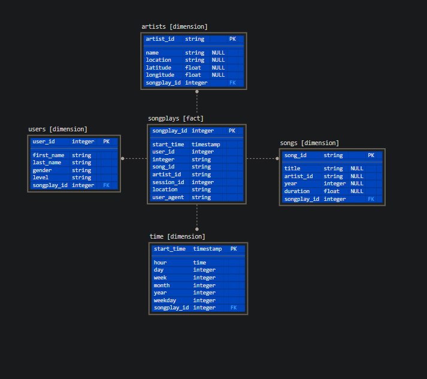

# Data_Modeling_with_Postgres

### Business context

Client wants to analyze data which is stored in collection of .json files. For such analysis required is to build reliable relational database which would let easy query this data. Technologies requested: Postgres database with access provided via Python script and/or SQL.

### Proposed solution
Database - based on Postgres is build using star schema, this will let complicated queries be executed quickly and efficiently. 
1. Database in star schema to be created using python as access point to Postgres database
2. ETL script build from couple of modules to populate those tables.

### Project content

This project contains two main files and flat database. It was done and tested on dockerized Postgres database thus credential need to be updated if checking other way.

#### Files

1. data/ - folder with .json input collection
2. create_table.py - file to run first. Contains script to create new schema in star design on the base of sql.queries built in sql_queries.py file. Sequence is: drop tables -> create tables.
3. sql_queries.py - varaibales that cointains postgresql queries for tables create, insert, match and lists for iterations to ensure all queries will be executed.
4. etl.py - file to run second. Contains all functions to populate previously created tables.
    a) main() - contains connection coordinates and data for data processor such as filepath that is feed to proces_data function
    b) proces_data(..) - fetches data from main() and process files from songs and logs folders to prepare input list to be parsed into DataFrames. Also it reports quantity of processed files. 
    c)process_song_file(..) - creates DataFrame with song details and inserting appropriate records into respective tables
    d)process_log_file(..) - creates DataFrame with log details and inserting appropriate records into respective tables. Also performs a matching for songplay_data to complete songplay table. 
    
### Database layout

1. songplay - fact table with songplay_id as it's primary key, which will be generated automatically by Postgress to ensure uniqueness
2. artist - dimension table with artists data, artist_id is unique thus set as primary key
3. songs - dimension table with songs data, song_id is unique thus set as primary key
4. users - dimension table contains all users with appropriate data, user can log multiple time thus no primary key is set here
5. time - dimension table created based on start_time and converted for analysis purposes

###Schema layout

 